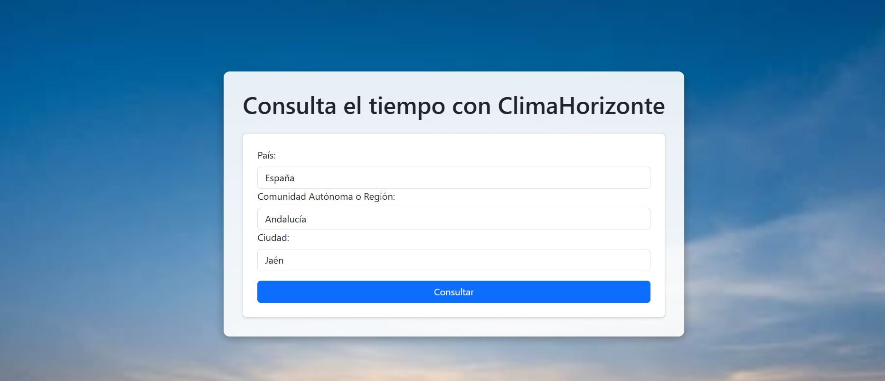
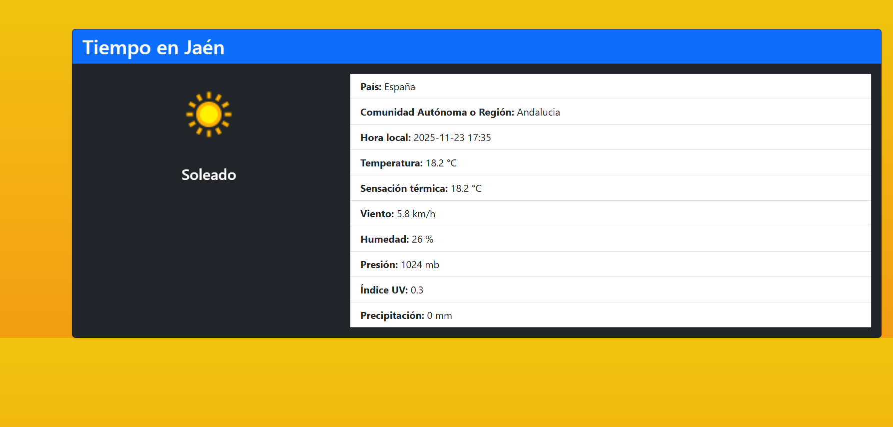
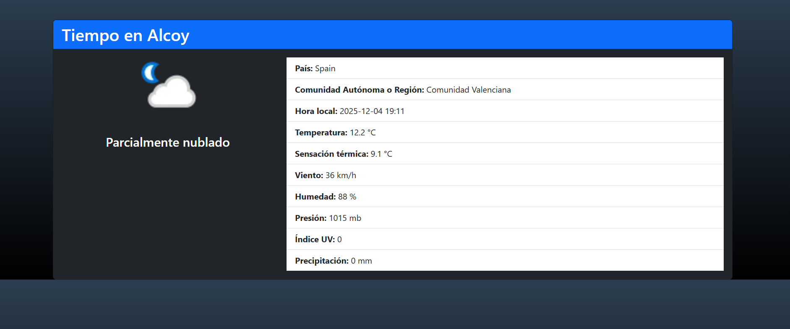
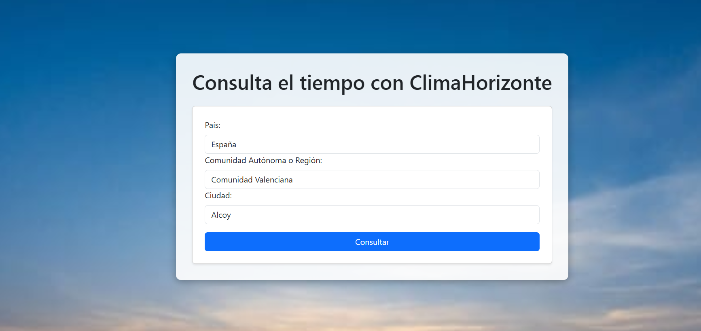

# 🌤️ ClimaHorizonte

Aplicación web desarrollada en **PHP 8.4** y **Laravel 12.3** que permite consultar el tiempo en cualquier ciudad mediante la API [WeatherAPI.com](https://www.weatherapi.com).  
El proyecto incluye un formulario de entrada donde el usuario selecciona **país, comunidad autónoma o región y ciudad**, y devuelve un formulario de resultados con todos los datos meteorológicos disponibles.

---

## 🎨 Capturas de pantalla

### Formulario de entrada

### Formulario de resultados

### Formulario de entrada

### Formulario de resultados

---

---

## 🚀 Características principales

- Backend construido con **Laravel 12.3**.
- Integración con la API externa **WeatherAPI.com**.
- Formulario de búsqueda con campos:
  - País
  - Comunidad Autónoma / Región
  - Ciudad
- Resultados presentados en un formulario estilizado con **Bootstrap 5** y **CSS embebido en Blade**.
- Fondo dinámico y diseño moderno para mejorar la experiencia visual.

---

## 🛠️ Tecnologías utilizadas

- **PHP 8.4**
- **Laravel 12.3**
- **Bootstrap 5.3**
- **CSS embebido en Blade** (animaciones, estilos de formularios, fondos)
- **Blade Templates**
- **API RESTful (WeatherAPI.com)**

---

## 📂 Estructura del proyecto

- `app/` → Lógica principal de Laravel (controlador).
- `resources/views/` → Vistas Blade (formulario de entrada y resultados, con estilos CSS embebidos).
- `public/images/` → Imágenes estáticas (fondos, iconos).
- `routes/web.php` → Definición de rutas de la aplicación.
- `routes/api.php` → Definición de ruta API para poder probar la aplicación vía API.

---

## 📄 Créditos

- Datos meteorológicos proporcionados por [WeatherAPI.com](https://www.weatherapi.com).
- Imágenes del formulario obtenidas de bancos de imágenes legales con licencia de uso.

---

## 📜 Licencia

Este proyecto está bajo la licencia [MIT](https://opensource.org/licenses/MIT).

El framework **Laravel** también es software open‑source con licencia MIT.

---

👨‍💻 Autor
Desarrollado por Alfonso

## ⚙️ Instalación y configuración

---

1. Clona el repositorio:
   
   git clone https://github.com/Fon-87/ClimaHorizonte.git

---

## 📸 Créditos de imágenes
La imagen utilizada en este proyecto proviene de [Vecteezy](https://www.vecteezy.com/) bajo licencia gratuita.

## 👤 Autor

- **Nombre:** Alfonso (Fon-87)  
- **GitHub:** [@Fon-87](https://github.com/Fon-87)  

   
